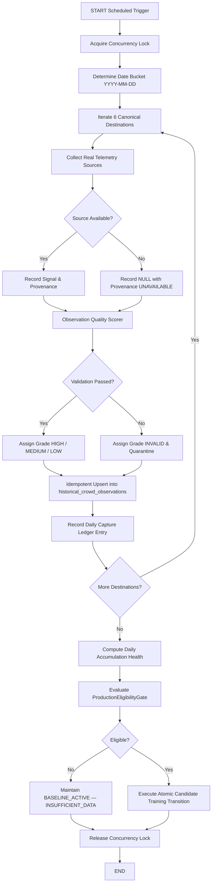

# Accumulation Health Protocol

**Milestone 13 / Prompt 12: Production Observability, Gap Auditing & Capture Reliability**

---

## 1. Executive Summary & Principles

The Yatri Setu historical crowd intelligence pipeline accumulates genuine, time-aligned daily observations across 6 canonical Himalayan destinations:
1. `darjeeling`
2. `kalimpong`
3. `mirik`
4. `lava`
5. `lolegaon`
6. `rishop`

The pipeline is governed by five strict operational laws:
1. **Truthful Data > Apparent Progress**: Real observations must originate from genuine physical telemetry or authoritative event catalogs. Missing signals remain `NULL` (never manufactured or defaulted to 0.0).
2. **Provenance > Completeness**: Every signal slot records provider identity, mode (`LIVE`, `HISTORICAL`, `COMPUTED`, `UNAVAILABLE`), confidence, and availability.
3. **Idempotency > Speed**: Re-running a capture cycle for a `(destination, date_bucket)` pair must never increase eligible row counts or duplicate records.
4. **Observability > Assumptions**: Destination presence, source freshness, and retry attempts are captured in a durable, queryable operational ledger.
5. **Eligibility Gate > Premature ML**: The `ProductionEligibilityGate` remains the sole, immutable gatekeeper for production XGBoost training.

---

## 2. Daily Capture Lifecycle

Each automated or scheduled accumulation cycle proceeds through a deterministic state progression:

---

## 3. Operational Status Definitions

For every canonical `destination × observation_date` pair, the health service establishes a deterministic status:

| Operational Status | Criteria | ML Eligible? | Ledger Record |
| :--- | :--- | :--- | :--- |
| `CAPTURED_VALID` | Legitimate observation recorded, passes quality scoring (`HIGH`, `MEDIUM`, or `LOW`), target present. | **YES** | `validation_passed=True`, `ml_eligible=True`, `is_quarantined=False` |
| `CAPTURED_INVALID` | Observation present in database, but failed quality/integrity checks (e.g. future date, non-canonical ID, invalid timestamp, missing target). | **NO** | `validation_passed=False`, `ml_eligible=False`, `is_quarantined=True`, `quarantine_reason` populated |
| `MISSING` | Expected destination/date pair absent from database (capture failed or not yet attempted). | **NO** | `final_status="MISSING"`, `ml_eligible=False` |
| `INCOMPLETE` | Telemetry record present, but ground-truth `current_crowd_pressure` target is unmeasured (`NULL`). | **NO** | `final_status="INCOMPLETE"`, `ml_eligible=False` |
| `DUPLICATE` | Multiple records detected for identical `(destination, date_bucket)`. Database uniqueness constraint rejects duplicates; ledger logs `duplicates_prevented`. | **NO** | `is_duplicate=True`, `final_status="DUPLICATE"` |
| `EXPECTED` | Expected destination/date in audit window before cycle execution. | **NO** | Default status before capture execution |

---

## 4. Daily Completeness Classifications

Daily completeness assesses all 6 canonical destinations collectively for a specific calendar date:

- **`FULL_SUCCESS`**: Exactly 6/6 canonical destinations are `CAPTURED_VALID`. Zero missing, zero invalid, zero incomplete.
- **`PARTIAL_SUCCESS`**: Between 1 and 5 canonical destinations are `CAPTURED_VALID`. At least one destination is missing, invalid, or incomplete.
- **`FAILED`**: 0/6 canonical destinations are `CAPTURED_VALID`.

---

## 5. Durable Operational Capture Ledger

The database schema includes a dedicated table `daily_capture_ledger` backed by `DailyCaptureLedgerModel`:
- Primary key: `{destination_id}_{date_bucket}_{dataset_mode}`
- Enforces SQL-level uniqueness on `(destination_id, date_bucket, dataset_mode)`.
- Records:
  - Timestamp of capture attempt and completion.
  - Number of attempts and retries.
  - JSON arrays of attempted, succeeded, and failed telemetry sources.
  - Validation verdict, quality error messages, and quarantine status.
  - Exact reference to the persisted observation ID.

---

## 6. Source Health & Freshness Monitoring

Legitimate telemetry providers monitored by `AccumulationHealthService`:

1. **Weather**: `OPEN_METEO_LIVE` — Live mountain temperature, precipitation chance, comfort index.
2. **Bookings**: `POSTGRESQL_BOOKINGS` — Homestay reservations velocity and volume.
3. **Accommodation**: `HOMESTAY_INVENTORY` — Registered homestay room inventory and occupancy.
4. **Search Demand**: `DEMAND_EVENTS_NETWORK` — First-party traveler search and itinerary discovery.
5. **Events**: `EVENTS_ENGINE` — Local cultural festival & regional gathering catalog.
6. **Holidays**: `HOLIDAY_ENGINE` — Official calendar gazetted surge multiplier.
7. **Traffic**: `CORRIDOR_TRAFFIC` — Himalayan highway corridor transit delay observations.
8. **Crowd Engine**: `CROWD_ENGINE_V2_COMPUTED` — Multi-signal deterministic crowd pressure target.

### Freshness Statuses:
- **`FRESH`**: Last successful telemetry reading was captured within ≤ 24 hours.
- **`STALE`**: Last successful reading was captured > 24 hours ago.
- **`UNAVAILABLE`**: Provider was attempted but yielded no legitimate measurement (or suppressed due to non-real origin).
- **`UNKNOWN`**: No telemetry attempts recorded yet.

### Rule on Source Failures:
When a source fails or is offline, the pipeline records `source_status = FAILED`, `value = NULL`, and explicit provenance notes (`notes = "Signal unmeasured or provider unavailable; kept NULL"`). It **never** manufactures artificial defaults (e.g. 0.0) or carries over stale readings without attribution.

---

## 7. Concurrency Safety & Idempotency

- **Scheduler Lock**: Multi-worker environments acquire `_CAPTURE_SCHEDULER_LOCK` (re-entrant thread/process lock) during capture cycles.
- **Database Idempotency**:
  - `HistoricalObservationModel` primary key: `{destination_id}_{date_bucket}_{dataset_mode}`
  - Unique constraint: `(destination_id, date_bucket, dataset_mode)`
  - Re-running capture on an existing date performs an idempotent update if signals legitimately changed, or increments `duplicates_prevented` if identical. Eligible rows increase **at most once**.

---

## 8. Accumulation Velocity Calculation

Velocity is calculated directly from active database rows:
- `eligible_rows_last_1_day`
- `eligible_rows_last_7_days`
- `eligible_rows_last_14_days`
- `eligible_rows_last_30_days`
- `average_daily_eligible_rows_7d`
- `average_daily_eligible_rows_14d`
- `average_daily_eligible_rows_30d`

Where historical dates in a sliding window are insufficient to compute a mathematically sound rolling average, the service explicitly returns:
`"INSUFFICIENT_HISTORY"`
rather than interpolating or inventing a rate. INVALID audit records and synthetic records are strictly excluded from velocity calculations.

---

## 9. Hardened Projection Semantics

Projections answer when the dataset could theoretically reach gate eligibility:

$$\text{Theoretical Minimum Days} = \max\left(\left\lceil \frac{180 - \text{eligible\_rows}}{6.0} \right\rceil, \max_{d}(20 - \text{depth}_d), 30 - \text{temporal\_span}\right)$$

### Non-Guarantee Safeguard:
Every projection response explicitly includes:
- `projection_status: "PROJECTED"`
- `guarantee: false`
- `theoretical_maximum_capture_rate: "6.0 rows/day (THEORETICAL_MAXIMUM_CAPTURE_RATE)"`
- Disclaimer stating that this is a mathematical projection under stated assumptions, not a guarantee or prediction of model forecast accuracy.

---

## 10. Failure Recovery Procedures

1. **Upstream API Outage**: Capture logs `UNAVAILABLE`, leaves signal `NULL`, records `MISSING` or `PARTIAL_SUCCESS` in ledger. Cycle continues safely; baseline model remains authoritative.
2. **Transient DB Network Error**: Bounded exponential backoff retries up to 3 times (0.5s, 1.0s, 1.5s). If all fail, failure is committed to ledger.
3. **Quarantine of Corrupted Data**: Observations with invalid dates, missing targets, or schema violations are graded `INVALID`, quarantined, excluded from ML datasets, and flagged in the daily health audit.
