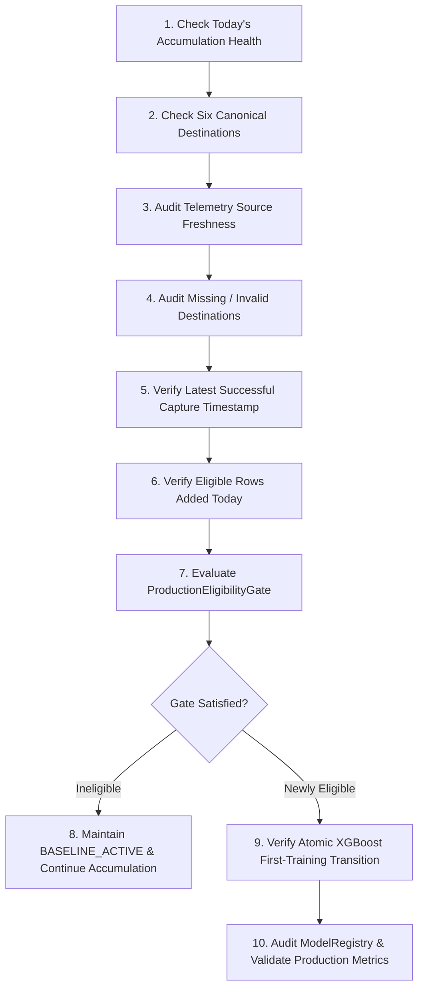

# Daily Accumulation Operations Runbook

**Milestone 13 / Prompt 12: Production Operator Checklist & Runbook**

---

## Daily 10-Step Operational Workflow



---

### Step 1: Check Today's Accumulation Health
Query the health endpoint:
```http
GET /api/admin/ml/accumulation-health
```
Verify:
- `status`: Should be `FULL_SUCCESS` for normal daily operations.
- `captured_count`: Should equal 6.
- `duplicates`: Must be 0.

---

### Step 2: Check Six Canonical Destinations
Verify the status for all six destinations in `destination_health`:
1. `darjeeling`: `is_depth_satisfied` or progress towards 20 rows.
2. `kalimpong`: `is_depth_satisfied` or progress towards 20 rows.
3. `mirik`: `is_depth_satisfied` or progress towards 20 rows.
4. `lava`: `is_depth_satisfied` or progress towards 20 rows.
5. `lolegaon`: `is_depth_satisfied` or progress towards 20 rows.
6. `rishop`: `is_depth_satisfied` or progress towards 20 rows.

Check `current_valid_streak` to confirm unbroken daily accumulation.

---

### Step 3: Audit Telemetry Source Freshness
Review the `source_health` block:
- Meteorological data: `OPEN_METEO_LIVE` status (`FRESH` ≤ 24h).
- Booking data: `POSTGRESQL_BOOKINGS` status.
- Homestay availability: `HOMESTAY_INVENTORY` status.
- Demand velocity: `DEMAND_EVENTS_NETWORK` status.
- Traffic transit: `CORRIDOR_TRAFFIC` status.
- Deterministic crowd target: `CROWD_ENGINE_V2_COMPUTED` status.

If any source displays `STALE` or `UNAVAILABLE`:
- Confirm whether upstream provider is experiencing downtime.
- Verify that the pipeline truthfully retained `NULL` rather than fabricating dummy values.

---

### Step 4: Audit Missing / Invalid Destinations
Inspect `invalid_destinations` and `missing_destinations`:
- If `invalid_destinations` > 0: Inspect `DailyCaptureLedgerModel` quarantine reasons (`quarantine_reason`, `validation_errors_json`). Common causes: clock drift causing future date buckets, unmeasured crowd pressure target.
- If `missing_destinations` > 0: Inspect `sources_failed` in the ledger. Trigger manual recovery if appropriate:
  ```http
  POST /api/admin/ml/accumulation-cycle
  ```

---

### Step 5: Verify Latest Successful Capture Timestamp
Check `latest_successful_capture`:
- Ensure timestamp is within the expected operational window.
- Verify time elapsed matches expected scheduler cadence (e.g. daily midnight run).

---

### Step 6: Verify Eligible Rows Added Today
Review `eligible_rows_added`:
- For a fully successful capture cycle, `eligible_rows_added` should increase by 6.
- Verify against total ML-eligible rows:
  ```http
  GET /api/admin/ml/accumulation-readiness
  ```
- Confirm `invalid_rows_added` = 0.

---

### Step 7: Evaluate ProductionEligibilityGate
Review the `eligibility` block:
- Check all 7 gate criteria:
  1. `dataset_mode == "REAL"`
  2. `ml_eligible_real_rows >= 180`
  3. `distinct_destinations >= 3`
  4. `minimum_destination_depth >= 20`
  5. `temporal_span_days >= 30`
  6. `target_availability_percent == 100%`
  7. `core_missingness_percent <= 70%`
  8. `target_variance >= 4.0`

---

### Step 8: If Ineligible, Continue Accumulation
If `eligible == false`:
- Status remains `BASELINE_ACTIVE — INSUFFICIENT_DATA`.
- Authoritative model remains `baseline_rule_v2`.
- Confirm training coordinator blocks premature training.
- Review mathematical projection (`theoretical_minimum_days`) without treating it as a guarantee.

---

### Step 9: If Newly Eligible, Verify Atomic Training Transition
When dataset reaches 180 eligible rows and 20 rows/destination:
1. Concurrency-safe transition detector flags `ELIGIBILITY_REACHED`.
2. System computes deterministic dataset SHA-256 fingerprint.
3. Candidate model trains on chronological leakage-free splits (Schema 2.0.0).
4. Automated benchmark evaluation compares candidate MAE/RMSE against baseline.
5. If candidate outperforms baseline, promotion succeeds atomically.

---

### Step 10: Verify Production Registry After Promotion
After successful promotion:
- Model registry marks `xgboost_crowd_v2.0.0` as `ACTIVE`.
- State machine enters `XGBOOST_ACTIVE`.
- Verify inference endpoints:
  ```http
  GET /api/admin/ml/status
  ```
- In the event of model regression or anomalous predictions, trigger safety rollback:
  ```http
  POST /api/admin/ml/rollback?reason=Operator+manual+rollback
  ```
