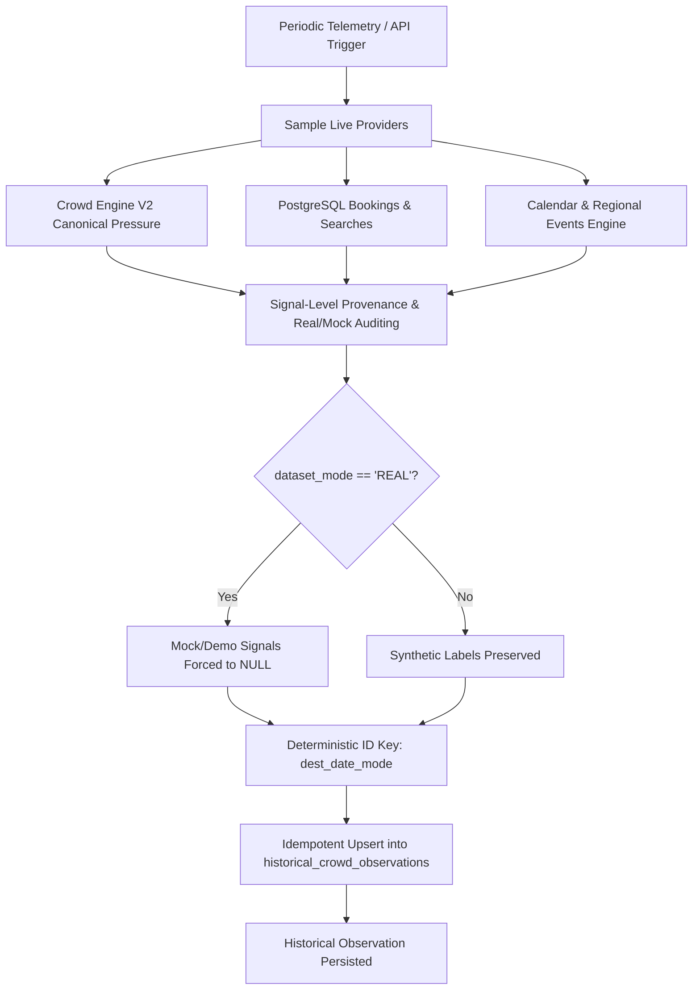

# Historical Tourism Data Foundation Architecture

**Yatri Setu — Milestone 10 / Prompt 3**  
*Canonical Multi-Signal Historical Observation Engine & Forecasting Foundation*

---

## 1. Executive Summary

This architecture establishes a production-grade **Historical Tourism Data Foundation** for Yatri Setu. It bridges live platform telemetry, verified PostgreSQL events, and canonical Crowd Engine V2 scores into an auditable, time-aligned historical observation store (`historical_crowd_observations`).

### Non-Negotiable Core Principles
1. **Zero Fabrication**: Real-world historical tourism footfall is NOT invented. If a signal is unmeasured, it remains strictly `NULL/UNAVAILABLE`.
2. **Explicit Provenance**: Every observation slot carries signal-level provenance (`LIVE`, `CACHED`, `HISTORICAL`, `COMPUTED`, `SYNTHETIC`, `DEMO`, `UNAVAILABLE`).
3. **Mode Separation**: Complete separation of `REAL`, `SYNTHETIC`, and `MIXED` datasets. Default ML pipelines never silently inject synthetic benchmark data into real training matrices.
4. **Leakage Prevention**: Forecasting targets at horizon $H$ ($T + H$) are rigorously separated from features observed at date $T$.
5. **Locked Frontend**: The frontend UI is untouched and visually locked; all 21 routes build cleanly.

---

## 2. Current Available Genuine Data vs. Synthetic Sources

### Verified Genuine Data Sources in Repository
| Signal | Origin Provider | Active Mode | Provenance Label |
| :--- | :--- | :--- | :--- |
| **Current Crowd Pressure** | `Crowd Engine V2` | `COMPUTED` | `COMPUTED_CROWD_ENGINE_V2` |
| **Booking Velocity** | PostgreSQL `bookings` & `homestays` | `HISTORICAL` / `LIVE` | `POSTGRESQL_BOOKING_TELEMETRY` |
| **Search Intent** | PostgreSQL `demand_events` | `HISTORICAL` | `HISTORICAL_FIRST_PARTY_SEARCHES` |
| **Live Traffic Congestion** | TomTom Flow API | `LIVE` / `CACHED` | `LIVE_TOMTOM_FLOW` |
| **Live Weather Pressure** | OpenWeatherMap API | `LIVE` / `CACHED` | `LIVE_OPENWEATHERMAP_API` |
| **Holiday / Calendar Surge** | Gazetted State/National Calendar | `COMPUTED` | `CALENDAR_HOLIDAY_ENGINE` |
| **Regional Events** | Verified Himalayan Events Catalog | `COMPUTED` | `REGIONAL_EVENTS_CATALOG` |

### Known Limitations & Synthetic Benchmarks
* **Historical Tourism Footfall**: **No public real-time or daily destination-level government API exists** for Himalayan micro-destinations (Darjeeling, Kalimpong, Mirik, Lava, Lolegaon, Rishop). Ministry of Tourism (India) publishes state-level annual reports, which are annual aggregates unsuitable for granular ML training.
* Therefore, in `REAL` dataset mode, **footfall is explicitly left NULL** (`provider_mode="UNAVAILABLE"`).
* The deterministic 2023 dataset generator (`historical_dataset.py`, Seed 42) is retained strictly for offline unit tests and benchmarking. It is explicitly labeled `SYNTHETIC` and is blocked from production training paths.

---

## 3. Canonical Historical Observation Schema

### PostgreSQL Table: `historical_crowd_observations`
Persisted via SQLAlchemy model `HistoricalObservationModel` in `backend/app/models/entities.py`:

```sql
CREATE TABLE historical_crowd_observations (
    id VARCHAR(64) PRIMARY KEY,                  -- Deterministic: {dest}_{date_bucket}_{mode}
    destination_id VARCHAR(64) NOT NULL,         -- Foreign Key to destinations.id
    observed_at TIMESTAMP NOT NULL,              -- Exact UTC timestamp of observation
    date_bucket VARCHAR(10) NOT NULL,            -- YYYY-MM-DD canonical alignment
    
    -- Multi-signal metrics (NULL if unmeasured)
    footfall FLOAT NULL,
    accommodation_occupancy FLOAT NULL,
    booking_demand FLOAT NULL,
    search_demand FLOAT NULL,
    traffic_pressure FLOAT NULL,
    weather_pressure FLOAT NULL,
    holiday_pressure FLOAT NULL,
    event_pressure FLOAT NULL,
    current_crowd_pressure FLOAT NULL,           -- Computed by canonical Crowd Engine V2

    -- Calendar & Environmental Context
    is_weekend BOOLEAN DEFAULT FALSE,
    is_holiday BOOLEAN DEFAULT FALSE,
    holiday_name VARCHAR(128) NULL,
    active_events_count INTEGER DEFAULT 0,

    -- Provenance & Metadata Auditing
    signal_provenance_json JSON NULL,            -- Dict of signal -> {source, provider_mode, confidence, is_available}
    data_status VARCHAR(32) DEFAULT 'PARTIAL',   -- COMPLETE | PARTIAL | DEGRADED | UNAVAILABLE | SYNTHETIC
    dataset_mode VARCHAR(32) DEFAULT 'REAL',     -- REAL | SYNTHETIC | MIXED
    composite_confidence FLOAT DEFAULT 0.0,
    ingested_at TIMESTAMP DEFAULT CURRENT_TIMESTAMP,

    CONSTRAINT uq_dest_date_bucket_mode UNIQUE (destination_id, date_bucket, dataset_mode)
);

CREATE INDEX idx_hist_dest_observed_at ON historical_crowd_observations (destination_id, observed_at);
CREATE INDEX idx_hist_dest_bucket ON historical_crowd_observations (destination_id, date_bucket);
```

---

## 4. Signal-Level Provenance Model

Every persisted signal slot records an immutable audit trail (`SignalProvenanceRecord`):
* `source`: Specific provider origin identifier (e.g., `LIVE_TOMTOM_FLOW`, `POSTGRESQL_BOOKING_TELEMETRY`, `CALENDAR_HOLIDAY_ENGINE`).
* `provider_mode`: Classification matching `VALID_PROVIDER_MODES`:
  - `LIVE`: Directly sampled from a live external network API.
  - `CACHED`: Live data served from local cache.
  - `HISTORICAL`: Genuine database events persisted over time.
  - `COMPUTED`: Canonically derived by deterministic platform engines (`Crowd Engine V2`, `holiday_engine`).
  - `SYNTHETIC`: Deterministic benchmark simulation (Seed 42).
  - `DEMO`: Offline development fallback.
  - `UNAVAILABLE`: Unmeasured or offline signal; value is strictly `None`.
* `confidence`: Signal confidence score ($0.0 \le c \le 1.0$).
* `is_available`: Boolean indicating whether the signal was genuinely measured.
* `raw_value` & `raw_unit`: Original un-normalized metric (e.g. °C, confirmed bookings, congestion ratio).

---

## 5. Ingestion Pipeline & Idempotency

Implemented in `backend/app/services/historical/ingestion_service.py`:



### Idempotency Guarantee
The record ID is deterministically formed as:
$$\text{record\_id} = \text{destination\_id} + \text{"\_"} + \text{date\_bucket} + \text{"\_"} + \text{dataset\_mode.lower()}$$
Repeated ingestion of the same destination, date, and mode updates the record rather than creating uncontrolled duplicates.

---

## 6. Time Alignment & Forecasting Leakage Prevention

### Canonical Time Bucket
The canonical alignment interval is **daily** (`YYYY-MM-DD`), matching the resolution of regional bookings, calendar festivals, and accommodation turnover.

### Leakage Prevention Architecture
When generating training matrices for forecasting with horizon $H$ (e.g. $H=1$ day ahead):

```
Time Axis:
T (Feature Timestamp) --------------------> T + H (Target Timestamp)
  [Features X at date T]                      [Ground Truth Target Y at date T+H]
  - Weather at T                               - Current Crowd Pressure at T+H
  - Traffic at T
  - Bookings at T
  - Day of week at T
```

1. **Feature Timestamp ($T$)**: Date at which all input features are extracted. Features at $\ge T + 1$ are strictly forbidden.
2. **Target Timestamp ($T + H$)**: Future observation date from which `current_crowd_pressure` is extracted.
3. **Verification Assertion**:
   $$\text{feature\_timestamp} < \text{target\_timestamp}$$
   Rows without a corresponding future observation (e.g., the last observation in a series) are excluded from the forecasting training set rather than inventing future ground truth.

---

## 7. Dataset Modes: REAL vs. SYNTHETIC vs. MIXED

| Feature / Attribute | `REAL` Mode | `SYNTHETIC` Mode | `MIXED` Mode |
| :--- | :--- | :--- | :--- |
| **Data Origin** | Genuine persisted observations in DB | Deterministic 2023 Generator (Seed 42) | Real DB observations + Synthetic benchmark |
| **Unmeasured Signals** | Retained as `None` (NULL) | Populated deterministically | Maintained per source |
| **Synthetic Rows Injected?** | **NEVER** | 100% | Only on explicit caller request |
| **Production ML Eligibility** | Allowed if $\ge 365$ rows | **FORBIDDEN** (`ml_eligible = False`) | Requires disclosure & approval |
| **Transparency Metadata** | Reports signal availability % | Labeled `SYNTHETIC DEMO DATA` | Discloses exact real vs. synthetic row counts |

---

## 8. Dataset Audit Metadata (`DatasetMetadata`)

Every dataset produced by `MLDatasetBuilder` exposes a Pydantic metadata record:
* `dataset_mode`: `REAL` | `SYNTHETIC` | `MIXED`
* `destination_count` & `destinations`: Unique destinations represented.
* `row_count`: Total training rows.
* `real_row_count` vs. `synthetic_row_count`: Exact row counts by origin.
* `signal_availability_percentages`: Percent of non-NULL observations for each signal.
* `provenance_counts`: Distribution of provider modes.
* `target_horizon_days`: Forecasting lookahead horizon ($H$).
* `leakage_prevention_verified`: True when target timestamp $> $ feature timestamp for all rows.
* `ml_eligible`: True only when $\ge 365$ genuine real observations exist.

---

## 9. Historical Data API Endpoints

Additive, non-breaking endpoints registered under `/api/v1/historical`:

| Method | Endpoint | Description |
| :--- | :--- | :--- |
| `GET` | `/api/v1/historical/status` | Reports storage dialect, total records, real vs. synthetic breakdown, and ML readiness threshold. |
| `GET` | `/api/v1/historical/observations` | Filter observations by `destination_id`, `start_date`, `end_date`, and `dataset_mode`. |
| `GET` | `/api/v1/historical/latest` | Returns the most recent persisted observation for a destination. |
| `GET` | `/api/v1/historical/provenance` | Summary of signal availability percentages and provenance counts. |
| `POST` | `/api/v1/historical/ingest` | Idempotently captures and persists current live observations. |

---

## 10. Feeding Prompt 4's XGBoost Forecasting Pipeline

In Prompt 4, the XGBoost upgrade will consume this historical foundation:
1. **Feature Columns**: `historical_footfall`, `accommodation_occupancy`, `booking_demand`, `search_demand`, `event_pressure`, `holiday_pressure`, `weather_pressure`, `traffic_pressure`, temporal calendar cycles (`day_of_week`, `is_weekend`, `month`, `day_of_year`), and one-hot destination indicators.
2. **Missing Value Handling**: XGBoost natively handles `NaN`/`NULL` feature inputs using default split directions. Unmeasured signals in real observations (like footfall) do not break training or require fabricated numbers.
3. **Forecasting Target**: $H$-day ahead crowd pressure (`current_crowd_pressure` at $T + H$).
4. **Model Governance**: The model registry will inspect `DatasetMetadata` before saving any model to ensure that production models are trained on genuine historical data rather than unverified synthetic simulations.
