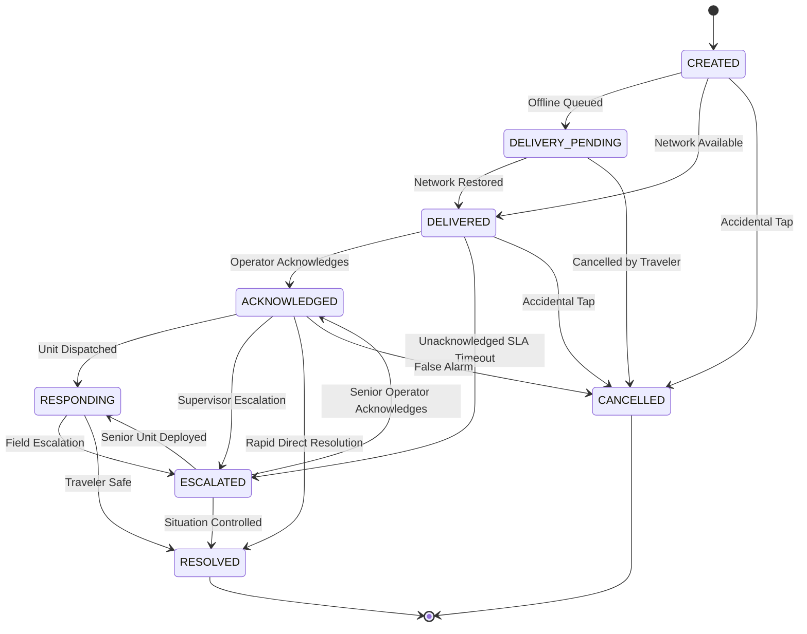

# Milestone 7F: Safety, SOS & Emergency Operations Layer

## Executive Summary & Scope

Milestone 7F upgrades Yatri Setu from a passive SOS beacon screen into an end-to-end, deterministic **Emergency Operations Workflow**:

$$\text{Tourist SOS Trigger} \longrightarrow \text{Location / Context Capture} \longrightarrow \text{Normalized Incident} \longrightarrow \text{Command Center Triage} \longrightarrow \text{Operator Acknowledgement} \longrightarrow \text{Field Response} \longrightarrow \text{Resolution} \longrightarrow \text{Audit Log}$$

### Important System Disclaimers & Guarantees
> [!IMPORTANT]
> **Emergency-Support Scope Guarantee**:
> 1. **Not an Official Emergency Replacement**: Yatri Setu provides an internal coordination layer connecting tourists, verified local rural volunteers (*Yatri Mitra* network), and regional nodal tourism monitoring desks. It is **not a replacement for official national emergency numbers (112, Police, Fire, Ambulance)**.
> 2. **No False Dispatch Claims**: The system never claims direct police, fire, or hospital ambulance dispatch unless a genuine external API integration exists and is actively connected.
> 3. **Data Provenance Transparency**: All incident delivery states explicitly display provenance:
>    - `REAL — YATRI SETU NETWORK` (internal volunteer & desk relay)
>    - `DEMO — SYNTHETIC` (simulated environment)
>    - `OFFICIAL INFORMATION` (verified public helpline directory)
> 4. **No Tourism Demand Contamination**: Emergency incidents are strictly decoupled from crowd telemetry. An SOS incident **never** mutates tourism demand signals or crowd-pressure metrics.
> 5. **Privacy by Design**: Sensitive raw GPS coordinates are exposed only to authenticated operators and are redacted through automated retention scrubbing after 24 hours.

---

## 1. Safety Architecture Overview

The system adheres to clean service-oriented principles under `backend/app/services/safety/`:

```
backend/app/services/safety/
├── __init__.py           # Package exports
├── base.py               # Abstract BaseSafetyProvider and BaseNotificationProvider
├── schemas.py            # Normalized Pydantic models, state enums, audit records
├── providers.py          # Internal Yatri Setu Network & Demo Notification providers
├── repository.py         # Thread-safe in-memory store with mutex and retention scrubbers
└── service.py            # Core SafetyOperationsService orchestrating state machine & SLA
```

---

## 2. Emergency Incident Model

Normalized incident structure (`EmergencyIncident`):

| Field | Type | Description |
| :--- | :--- | :--- |
| `incident_id` | `str` | Unique human-readable ID (`SOS-YYYYMMDD-XXXXXX`) |
| `trip_id` | `Optional[str]` | Associated booking/trip ID |
| `traveler_session_id` | `Optional[str]` | Traveler session token |
| `destination_id` | `str` | Monitored destination (`kalimpong`, `darjeeling`, etc.) |
| `location` | `LocationData` | `latitude`, `longitude`, `accuracy_m`, `status`, `label` |
| `incident_type` | `IncidentType` | `SOS`, `MEDICAL`, `ACCIDENT`, `LOST`, `SECURITY`, `ROAD_BLOCKED`, `OTHER` |
| `severity` | `IncidentSeverity` | `CRITICAL`, `HIGH`, `MEDIUM`, `LOW` |
| `status` | `IncidentStatus` | Strict lifecycle state |
| `notes` | `Optional[str]` | Traveler description or landmark notes |
| `user_name` | `str` | Traveler name |
| `user_phone` | `str` | Verified contact number |
| `created_at` | `str (ISO8601)` | Timestamp when signal was generated |
| `delivered_at` | `Optional[str]` | Timestamp when signal reached operations desk |
| `acknowledged_at` | `Optional[str]` | Timestamp when operator acknowledged incident |
| `responding_at` | `Optional[str]` | Timestamp when field units were deployed |
| `escalated_at` | `Optional[str]` | Timestamp when escalation triggered |
| `resolved_at` | `Optional[str]` | Timestamp when situation was closed safe |
| `cancelled_at` | `Optional[str]` | Timestamp if cancelled by traveler |
| `delivery_latency_seconds` | `Optional[float]` | Observed network delivery latency |
| `acknowledgement_latency_seconds` | `Optional[float]` | Observed operator acknowledgement latency |
| `assigned_operator` | `Optional[str]` | Desk operator ID |
| `escalation_level` | `int` | `0` (normal) or `1` (escalation required) |
| `escalation_reason` | `Optional[str]` | Reason for supervisory escalation |
| `provenance` | `str` | `REAL — YATRI SETU NETWORK` or `DEMO — SYNTHETIC` |
| `repeat_count` | `int` | Number of rapid panic taps debounced |
| `idempotency_key` | `Optional[str]` | Idempotency token preventing duplicate incidents |
| `route_context` | `RouteSafetyContext` | Corridor name, access status, weather notice |
| `audit_trail` | `List[IncidentAuditRecord]` | Immutable append-only transition log |

---

## 3. Deterministic SOS State Machine



### Transition Invariants
- Invalid transitions (e.g. `DELIVERED` &rarr; `RESOLVED` directly) are strictly rejected with HTTP 400.
- `CANCELLED` and `RESOLVED` are terminal states.
- Accidental cancellation does **not delete** the incident; the complete audit record is preserved.

---

## 4. Location Handling & Low-Connectivity Resilience

### GPS Optionality
- An incident without GPS coordinates **is completely valid**. The system assigns `location.status = "UNAVAILABLE"`, sets coordinates to `None`, and relies on cellular cell tower / destination region context without failing the SOS.
- Coordinates are validated against geographical bounds: $-90^\circ \le \text{lat} \le 90^\circ$, $-180^\circ \le \text{lon} \le 180^\circ$.
- No false precision: accuracy is bounded to reported meters (e.g. `±25m`).

### Offline-First Client Architecture
1. The client monitors `window.navigator.onLine`.
2. When offline or if network delivery fails, the request is stored in `localStorage` under `ys_pending_sos`.
3. The UI prominently displays:
   > *"Emergency request queued — waiting for network."*
4. The system never claims delivery to an operator while offline.
5. As soon as connectivity returns, the queued request is auto-transmitted to `/api/safety/sos` with `offline_queued: false`.

---

## 5. Duplicate Protection & Panic Debouncing

When travelers panic, they tap the SOS button repeatedly:
1. **Idempotency Key**: An `idempotency_key` (e.g. `IDEM-<phone>-<timestamp>`) guarantees that re-transmissions return the existing incident without creating duplicates.
2. **Rapid-Tap Debouncing**: Multiple taps within a 10-second window from the same verified phone number do not generate duplicate incidents. The existing incident's `repeat_count` is incremented, and a `DUPLICATE_SUPPRESSED` record is added to the audit trail.

---

## 6. Operator Workflow & SLA Latency Tracking

The Administrative Command Center (`/admin/command-center`) exposes full lifecycle operations:

1. **`GET /api/admin/safety/summary`**: Aggregates total active emergencies, severity counts, pending acknowledgments, escalations, and average acknowledgement latency.
2. **`GET /api/admin/safety/incidents`**: Filterable list by status, destination, and severity.
3. **`POST /api/admin/safety/incidents/{id}/acknowledge`**: Stamps operator ID, transitions state to `ACKNOWLEDGED`, and computes observed SLA latency:
   $$\text{acknowledgement\_latency} = t_{\text{acknowledged}} - t_{\text{delivered}}$$
4. **`POST /api/admin/safety/incidents/{id}/respond`**: Updates state to `RESPONDING`.
5. **`POST /api/admin/safety/incidents/{id}/escalate`**: Flags supervisory escalation (`ESCALATED`).
6. **`POST /api/admin/safety/incidents/{id}/resolve`**: Records closing resolution report and marks `RESOLVED`.

---

## 7. Deterministic Escalation Rules

- **Automatic Timeout Escalation**: If an incident is marked `CRITICAL` and remains in `DELIVERED` state unacknowledged after the configured timeout threshold (45 seconds default), the system automatically flags `ESCALATION_REQUIRED`, sets `escalation_level = 1`, and logs a `SYSTEM_ESCALATION_MONITOR` entry in the audit trail.
- The Command Center displays:
  > *"ESCALATION REQUIRED — Unacknowledged Critical Alert"*
  rather than falsely claiming external police notification.

---

## 8. Corridor & Severe Weather Context (M7C Integration)

When an incident occurs in a destination:
- The system checks the destination's active transport corridors from the Milestone 7C Traffic Service (e.g., `Gorubathan–Lava Pass`, Access: `CAUTION`).
- If severe weather is reported by the Weather Service, an informational notice is attached to the incident record.
- **Strict Causality Rule**: Telemetry is labelled as *situational context only*. The system does **not** infer that weather or traffic caused the emergency unless the tourist explicitly reports it.

---

## 9. Sensitive Location Privacy & Retention Scrubbing

- Public destination endpoints **never** expose precise tourist emergency coordinates.
- **Configurable Retention Window**: Through `POST /api/admin/safety/retention/scrub?hours_threshold=24`, raw coordinates (`latitude`, `longitude`, `accuracy_m`) of resolved or cancelled incidents older than 24 hours are scrubbed and replaced with `REDACTED_PER_PRIVACY_RETENTION_POLICY`.
- Non-sensitive operational audit logs, operator IDs, and timestamps remain preserved for compliance.

---

## 10. Verified Public Helplines Directory

Accessible via `GET /api/safety/contacts`:
- **112**: National Emergency Number (Police, Fire, Ambulance)
- **1363**: Incredible India 24x7 Multi-lingual Tourist Safety Helpline
- **1091**: Women in Distress Helpline
- **1070**: State Disaster Management Authority Control Room
- **+91 3552 255100**: Himalayan Mountain Rescue Desk (Regional Civil Desk)

All records are stamped: `OFFICIAL INFORMATION — VERIFIED PUBLIC SERVICE`.

---

## 11. Test Results & Verification

Full test suite executed via `pytest tests/ -v`:
- **Milestone 7F Test Suite (`test_milestone7f_safety.py`)**: 15 / 15 tests passed.
  - SOS creation with GPS and without GPS
  - Coordinate bounding and invalid coordinate handling
  - Idempotency key suppression
  - 5-tap panic debounce logic
  - Complete lifecycle state transitions (`CREATED` &rarr; `RESOLVED`)
  - Invalid state transition rejection (HTTP 400)
  - Accidental cancellation with audit retention
  - Manual and timeout-driven critical escalation
  - Offline queue state initialization
  - Official helpline directory verification
  - Sensitive GPS coordinate retention scrubbing
  - Strict segregation from tourism demand telemetry
  - Backward compatibility with legacy `test_safety_sos` payload
- **Total Workspace Backend Tests**: **209 passed**, 0 failed, 0 regressions.
- **TypeScript Compilation (`npx tsc --noEmit`)**: **0 errors**.
- **Next.js Production Build (`npm run build`)**: **21 / 21 routes generated successfully**.

---

## 12. Deterministic Demo Scenarios

### Scenario 1: Standard Mountain Rescue Beacon
1. Tourist opens `/safety/sos`.
2. Selects category **Medical Emergency**, severity **HIGH**.
3. Clicks **TRIGGER SOS**.
4. Distress beacon activates with siren sound and GPS coordinates.
5. In `/admin/command-center`, incident appears under **Active Emergencies**.
6. Operator clicks **Acknowledge** &rarr; observed latency is recorded.
7. Operator clicks **Mark Responding** &rarr; tourist status updates to *Response in progress*.
8. Operator clicks **Resolve** &rarr; incident moves to *Resolved Today*.

### Scenario 2: Offline-First SOS Queuing
1. Disconnect network or enable browser offline emulation.
2. Tourist triggers SOS on `/safety/sos`.
3. UI immediately displays: *"Emergency request queued — waiting for network."*
4. Reconnect network.
5. Click **Retry Broadcast** &rarr; incident automatically transmits and transitions to live tracking.

### Scenario 3: Accidental Tap Cancellation
1. Tourist activates SOS.
2. 15-second grace period countdown appears: *"Was this accidental? Cancel SOS"*.
3. Tourist clicks **Cancel SOS (Accidental Tap)** and enters reason: *"Pocket dialed"*.
4. Status updates to `CANCELLED`. In the Command Center, the incident is flagged cancelled without dispatching responders.
