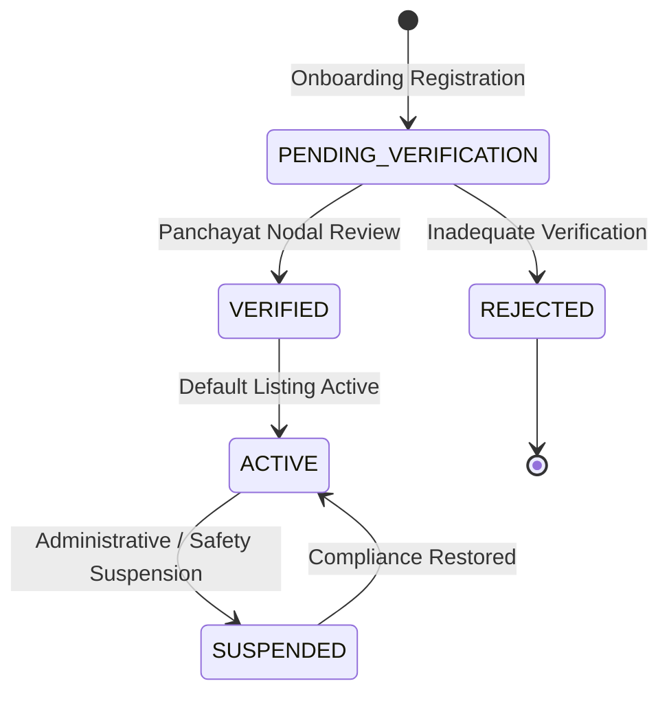
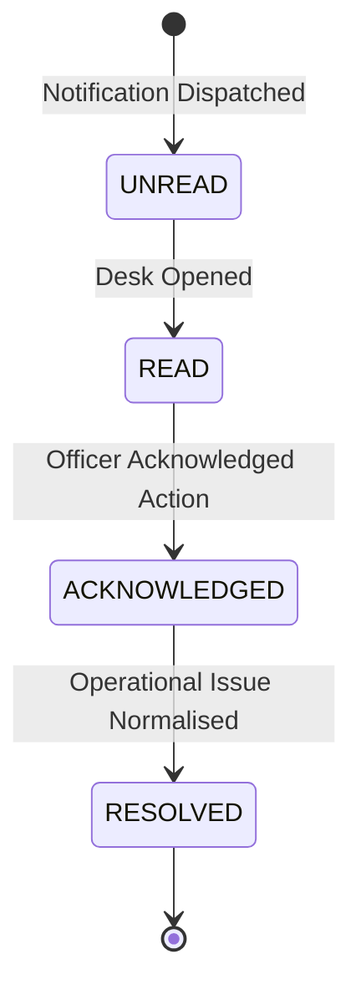

# Milestone 7G: Panchayat + Host + Local Economy Intelligence

## Executive Summary & Scope

Milestone 7G establishes the civic-economic backbone of Yatri Setu by interconnecting the rural tourism ecosystem into an authoritative, bidirectional operational loop:

$$\text{Tourist Demand} \longrightarrow \text{Destination Flow} \longrightarrow \text{Homestay Bookings} \longrightarrow \text{Host Dashboard} \longrightarrow \text{Local Economic Impact} \longrightarrow \text{Panchayat Desk} \longrightarrow \text{Capacity Advisories}$$

### Important System Disclaimers & Guarantees
> [!IMPORTANT]
> **Operational & Economic Guarantees**:
> 1. **Zero Duplicate Repositories**: Homestay listings, bookings, demand signals, and emergency incidents use single-source-of-truth services (`HomestayRepository`, `booking_lifecycle_service`, `FirstPartyDemandService`, `safety_operations_service`).
> 2. **Financial Transparency & Provenance**:
>    - Confirmed booking revenue is marked: `REAL — YATRI SETU NETWORK` (or `DEMO — SYNTHETIC`).
>    - Platform service fee (5%) is labeled: `CONFIGURED ASSUMPTION`.
>    - Host net payout estimate (90%) is clearly marked: `ESTIMATED FROM CONFIRMED BOOKINGS; PAYMENT SETTLEMENT NOT CONNECTED`.
>    - Taxes, municipal levies, and payment gateway fees are labeled: `NOT MODELED`.
>    - Capacity simulation flow is labeled: `SIMULATED — PLANNING SCENARIO` and **never** mutates real revenue or live booking records.
> 3. **Privacy & Data Minimization**:
>    - Strict zero-PII guarantee: Host and Panchayat views strictly exclude traveler names, personal phone numbers, emails, emergency contacts, and live GPS coordinates.
>    - Host dashboards display only booking reference, check-in/check-out dates, guest count, status, room units, and gross payout amounts.
>    - Panchayat desks view only anonymized arrival counts, aggregate night stays, and aggregate local economic impact.
> 4. **Civic Operational Authority**:
>    - Capacity warnings explicitly carry a disclaimer: `ADVISORY CAPACITY WARNING — DOES NOT CONSTITUTE A FORMAL GOVERNMENT RESTRICTION UNLESS RATIFIED BY DISTRICT MAGISTRATE / PANCHAYAT NODAL OFFICER`.

---

## 1. System Architecture Overview

The rural operations architecture is located under `backend/app/services/rural/`:

```
backend/app/services/rural/
├── __init__.py           # Package exports (RuralOperationsService, singleton instance)
├── schemas.py            # Normalized Pydantic models, state enums, audit records
└── service.py            # Thread-safe RuralOperationsService with RLock, canonical seeds & attribution
```

### Module Responsibilities

| File | Primary Responsibility |
| :--- | :--- |
| `schemas.py` | Pydantic contracts for `HostProfile`, `LocalAuthorityProfile`, `PanchayatNotification`, `HostNotification`, `HostBookingSnapshot`, `HostDemandSnapshot`, `HostEconomicSummary`, `HostDashboardData`, `DestinationLocalEconomy`, `PanchayatDashboardData`, `RuralAdminSummary`, `AuditLogRecord`. |
| `service.py` | Thread-safe operational coordinator (`RLock`), canonical host registry across 6 destinations (`kalimpong`, `lava`, `lolegaon`, `mirik`, `rishop`, `darjeeling`), dynamic booking-to-host attribution from `booking_lifecycle_service`, capacity warning detection, M7F safety aggregation, and audit logs. |
| `backend/app/api/v1/hosts.py` | REST endpoints for `/hosts/profile`, `/hosts/dashboard`, `/hosts/notifications`, `/hosts/{id}/suspend`, and `/host/*` spec alias router. |
| `backend/app/api/v1/panchayat.py` | REST endpoints for `/panchayat/profile`, `/panchayat/dashboard`, `/panchayat/notifications`, notification acknowledgment, resolution, and local economy analytics. |
| `backend/app/api/v1/admin.py` | REST endpoints for `/admin/rural/summary`, `/admin/rural/hosts`, `/admin/rural/destinations`, `/admin/rural/economy`, and `/admin/rural/audit-logs`. |

---

## 2. Entity Models & Lifecycle States

### Host Verification & Active States


### Local Authority Status
- `ACTIVE_DESK`: Dedicated physical/digital tourism helpdesk staffed during operational hours.
- `ON_CALL`: Designated Panchayat representative reachable for escalation.
- `UNMONITORED`: Automated capacity monitoring without assigned desk officer.

### Notification Lifecycle


---

## 3. Real Booking Attribution & Economics

### Revenue Engine & Attribution Pipeline
When a booking is confirmed via `booking_lifecycle_service`, the `RuralOperationsService`:
1. Maps `homestay_id` to the registered `HostProfile`.
2. Computes the financial split deterministically:
   - **Gross Booking Amount**: Direct sum of confirmed room rate nights.
   - **Platform Contribution (5%)**: Configured system maintenance assumption.
   - **Estimated Host Payout (90%)**: Net receivable attributed to host.
   - **Community Fund Contribution (5%)**: Civic development fund allocated to the local Panchayat.
3. Automatically updates real-time metrics:
   - `total_bookings_count` & `confirmed_stays_count`
   - `total_gross_booking_value_inr`
   - `estimated_host_payout_inr`
   - `community_fund_contributed_inr`
4. On cancellation, the booking is flagged as `CANCELLED`, occupancy freed, and estimated payouts safely adjusted without ledger corruption.

### Financial Provenance Labels

| Metric | Provenance Classification | Explanation |
| :--- | :--- | :--- |
| Gross Bookings | `REAL — YATRI SETU NETWORK` | Aggregated from actual confirmed bookings in memory |
| Platform Fee | `CONFIGURED ASSUMPTION` | 5% baseline fee model |
| Host Payout | `ESTIMATED FROM CONFIRMED BOOKINGS; PAYMENT SETTLEMENT NOT CONNECTED` | Theoretical payout; payout banking gateway decoupled |
| Community Fund | `LOCAL DEVELOPMENT REVENUE ALLOCATION` | 5% diverted towards Panchayat development projects |
| Flow Simulation | `SIMULATED — PLANNING SCENARIO` | Admin redistribution modeling, non-mutating |

---

## 4. Panchayat Operational Governance

### Unified Civic Dashboard
The `/api/panchayat/dashboard?destination_id={dest_id}` endpoint aggregates:
1. **Panchayat Authority Profile**: Official nodal officer, desk phone, gram panchayat, block, and district.
2. **Rural Ecosystem Metrics**: Verified homestays, total guide count, verified craft/nature experiences.
3. **Local Economic Impact**: Aggregate monthly arrivals, direct homestay revenue, and community fund reserve.
4. **Capacity Warning Banner**: Triggers when destination occupancy exceeds 85%, indicating high carrying capacity pressure.
5. **Safety Operations Summary**: Open SOS incidents, active field units, and resolved safety count from M7F with **zero traveler PII**.
6. **Operational Notifications**: Unread, acknowledged, and resolved warnings with full audit traceability.

---

## 5. Privacy & Data Minimization Architecture

### Strict PII Scrubbing Rules
To protect traveler safety and conform to digital personal data protection standards:
- **Host Dashboard**:
  - `booking_id`: Partially masked or human-readable reference.
  - `check_in` / `check_out`: ISO dates.
  - `guests_count`: Aggregate number only.
  - `guest_name`: Redacted to `Guest (Confidential)`.
  - `guest_phone`: **Completely omitted**.
  - `emergency_contacts`: **Completely omitted**.
  - `traveler_location`: **Completely omitted**.
- **Panchayat Portal**:
  - Displays only aggregated headcount and destination-wide safety statistics.
  - Raw GPS coordinates, names, and contact numbers of distressed travelers are restricted exclusively to the authorized emergency command center.

---

## 6. Verification & Test Baseline

### Test Suite Execution
- **Baseline Tests (M1 to M7F)**: 209 tests passing.
- **Milestone 7G Tests (`tests/test_milestone7g_rural_economy.py`)**: 12 new comprehensive tests passing.
- **Total Backend Tests**: **221 passed, 0 failures, 0 regressions** in 6.54s.
- **Frontend Verification**:
  - `npx tsc --noEmit`: 0 errors.
  - Next.js production build (`npm run build`): Successful, 21 routes compiled and static/dynamic optimized.

### Milestone 7G Test Matrix

| Test Name | Coverage & Invariants |
| :--- | :--- |
| `test_get_normalized_host_profile` | Validates host profile retrieval and verified badge status. |
| `test_host_alias_route_compliance` | Confirms `/api/host/*` and `/api/hosts/*` route compatibility. |
| `test_host_onboarding_and_suspension_lifecycle` | Validates new host registration, status transitions, and suspensions. |
| `test_homestay_ownership_consistency` | Verifies homestay-to-host mapping across all seed destinations. |
| `test_confirmed_booking_attributed_to_host_dashboard` | Asserts confirmed booking accurately updates host revenue and metrics. |
| `test_cancellation_releases_payout_and_records_cancellation` | Verifies cancellation increments cancellation count and updates totals. |
| `test_panchayat_profile_and_dashboard` | Confirms civic profile, local economy metrics, and capacity warnings. |
| `test_panchayat_notifications_acknowledge_and_resolve` | Asserts state transition: `UNREAD` &rarr; `ACKNOWLEDGED` &rarr; `RESOLVED`. |
| `test_panchayat_safety_summary_excludes_traveler_pii_and_gps` | Guarantees zero traveler PII or raw GPS coordinates in Panchayat views. |
| `test_admin_rural_summary_and_destinations` | Validates circuit-wide destination aggregation and KPI reporting. |
| `test_admin_rural_audit_logs` | Confirms immutable append-only audit trail logging for administrative actions. |
| `test_flow_simulation_does_not_generate_real_revenue_or_demand` | Ensures simulated flow does not corrupt live booking or economic ledgers. |

---

## 7. API Reference

### Host Operations
- `GET /api/hosts/profile` & `GET /api/host/profile`: Retrieve active host profile.
- `GET /api/hosts/{host_id}/profile`: Retrieve specific host profile.
- `GET /api/hosts/dashboard` & `GET /api/host/dashboard`: Retrieve host booking & economic dashboard.
- `GET /api/hosts/notifications` & `GET /api/host/notifications`: Retrieve host operational advisories.
- `POST /api/hosts/{host_id}/suspend`: Administratively suspend a host.

### Panchayat Operations
- `GET /api/panchayat/profile?destination_id={id}`: Retrieve Gram Panchayat authority details.
- `GET /api/panchayat/dashboard?destination_id={id}`: Retrieve unified civic dashboard data.
- `GET /api/panchayat/notifications?destination_id={id}`: Retrieve civic notifications.
- `POST /api/panchayat/notifications/{id}/acknowledge`: Acknowledge an advisory notification.
- `POST /api/panchayat/notifications/{id}/resolve`: Resolve an advisory notification.
- `GET /api/panchayat/economy?destination_id={id}`: Retrieve detailed local economy breakdown.

### Circuit Admin Operations
- `GET /api/admin/rural/summary`: Retrieve circuit-wide rural economy summary.
- `GET /api/admin/rural/hosts`: List all registered hosts with verification states.
- `GET /api/admin/rural/destinations`: List destination economic & capacity profiles.
- `GET /api/admin/rural/economy?destination_id={id}`: Destination local economy telemetry.
- `GET /api/admin/rural/audit-logs`: Immutable log of host, panchayat, and admin events.

---

## 8. Frontend Implementation

1. **Host Dashboard (`/host/dashboard`)**:
   - Clean, high-contrast UI displaying host verification status, bank account link warning, and settlement disclaimer.
   - 4 primary metric cards: Confirmed Stays, Gross Booking Value, Estimated Host Payout, and Live Demand Views.
   - Confirmed bookings list with zero traveler PII (guest name masked, no phone or GPS).
   - Demand telemetry overview displaying conversion ratios and search intent.
   - Operational advisories list with priority badges.

2. **Panchayat Portal (`/panchayat`)**:
   - Destination selector covering all 6 Darjeeling-Kalimpong circuit nodes.
   - High-visibility carrying capacity warning banner with official non-statutory disclaimer.
   - Real-time civic KPIs: Verified Homestays, Community Fund Reserve, Monthly Arrivals, Relief Index.
   - M7F emergency safety aggregation card (active SOS, field units, resolved cases) with zero traveler PII.
   - Operational advisory notification manager with inline "Acknowledge" and "Resolve" action controls.

3. **Admin Command Center (`/admin/command-center`)**:
   - Dedicated "Rural Tourism & Local Economy Intelligence" panel.
   - Circuit KPI summary: Total Registered Hosts, Verified Hosts, Homestay Capacity Units, Circuit Gross Booking Value, Host Payouts, and Community Fund.
   - Circuit destination economic breakdown table with carrying capacity status and direct links to Panchayat and Host portals.
   - Financial transparency and platform neutrality declaration.
