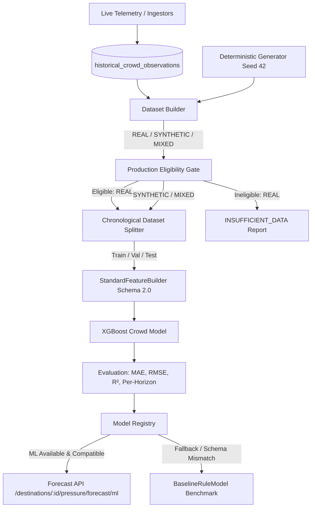

# Yatri Setu — XGBoost Crowd Forecasting Architecture (Milestone 11 / Prompt 4)

## 1. Architectural Distinction: Current vs Future Crowd Pressure

A core design principle of Yatri Setu is the clear operational separation of concerns between current state estimation and future forecasting:

```
                  ┌──────────────────────────────────────────────┐
                  │              INCOMING TELEMETRY              │
                  │   (Footfall, Occupancy, Bookings, Searches,  │
                  │       Traffic, Weather, Calendar Events)     │
                  └──────────────────────┬───────────────────────┘
                                         │
                 ┌───────────────────────┴───────────────────────┐
                 ▼                                               ▼
   ┌───────────────────────────┐                   ┌───────────────────────────┐
   │    CROWD ENGINE V2        │                   │    XGBOOST FORECASTING    │
   │  (Current Ground Truth)   │                   │   (Future Target H Days)  │
   ├───────────────────────────┤                   ├───────────────────────────┤
   │ • State at timestamp T    │                   │ • Predicts pressure(T + H)│
   │ • Canonical current score │                   │ • Trained on past (T, T+H)│
   │ • Deterministic weighted  │                   │ • Strict leakage boundary │
   │ • Auditable provenance    │                   │ • Missing-value resilient │
   └───────────────────────────┘                   └───────────────────────────┘
```

* **Crowd Engine V2** is the canonical source of truth for **CURRENT** crowd pressure at time $T$. It aggregates available telemetry signals with auditable data provenance and confidence tracking. XGBoost NEVER replaces Crowd Engine V2 and is NEVER used to invent or override current pressure.
* **XGBoost Regressor** predicts **FUTURE** crowd pressure at time $T + H$ (where $H \in \{1, 3, 7, 14\}$ days), using exclusively information available at or before feature timestamp $T$.

---

## 2. End-to-End Data Flow



---

## 3. Canonical Feature Schema (Version 2.0.0)

Training and inference share a single source of truth: `StandardFeatureBuilder`. Both paths produce an identical 22-dimensional feature schema, eliminating manual inference multipliers and discrepancy bugs.

### Feature Dictionary Specification

| # | Feature Name | Type | Description | Temporal Availability at $T$ |
|---|---|---|---|---|
| 1 | `historical_footfall` | `float` (NaN-safe) | Latest observed footfall pressure score | Known at $T$ |
| 2 | `accommodation_occupancy` | `float` (NaN-safe) | Hotel / homestay occupancy rate | Known at $T$ |
| 3 | `booking_demand` | `float` (NaN-safe) | Active confirmed bookings | Known at $T$ |
| 4 | `search_demand` | `float` (NaN-safe) | Destination query and search interest | Known at $T$ |
| 5 | `event_pressure` | `float` (NaN-safe) | Scheduled festivals and cultural events | Calendar at $T$ |
| 6 | `holiday_pressure` | `float` (NaN-safe) | Official government / bank holidays | Calendar at $T$ |
| 7 | `weather_pressure` | `float` (NaN-safe) | Weather impact index (IMD / OpenWeather) | Latest observation at $T$ |
| 8 | `traffic_pressure` | `float` (NaN-safe) | Corridor congestion score (Google/TomTom/Corridor) | Latest observation at $T$ |
| 9 | `day_of_week` | `int` (0–6) | Day of week for target date (0=Mon, 6=Sun) | Deterministic |
| 10 | `is_weekend` | `int` (0/1) | Weekend flag (Friday–Sunday) for target date | Deterministic |
| 11 | `month` | `int` (1–12) | Calendar month for target date | Deterministic |
| 12 | `day_of_year` | `int` (1–366) | Day of year for target date | Deterministic |
| 13 | `search_to_booking_ratio` | `float` (NaN-safe) | Leading demand indicator: $\frac{\text{search}}{\text{booking} + 10^{-3}}$ | Ratio at $T$ |
| 14 | `is_peak_summer` | `int` (0/1) | High season summer flag (April, May, June) | Deterministic |
| 15 | `is_peak_autumn` | `int` (0/1) | Puja / autumn holiday flag (Sept, Oct, Nov) | Deterministic |
| 16 | `target_horizon_days` | `int` (1, 3, 7, 14) | Explicit forecast distance $H$ | Deterministic |
| 17 | `dest_darjeeling` | `int` (0/1) | One-hot destination indicator | Deterministic |
| 18 | `dest_kalimpong` | `int` (0/1) | One-hot destination indicator | Deterministic |
| 19 | `dest_mirik` | `int` (0/1) | One-hot destination indicator | Deterministic |
| 20 | `dest_lava` | `int` (0/1) | One-hot destination indicator | Deterministic |
| 21 | `dest_lolegaon` | `int` (0/1) | One-hot destination indicator | Deterministic |
| 22 | `dest_rishop` | `int` (0/1) | One-hot destination indicator | Deterministic |

---

## 4. Forecast Horizons and Leakage-Safe Target Alignment

### Horizon Definitions
Four explicit forecasting horizons are supported across the Eastern Himalayan region:
* **1 Day ($H=1$)**: Short-term tactical dispersion and day-tripper surge management.
* **3 Days ($H=3$)**: Weekend planning and route advisory for Siliguri corridor arrivals.
* **7 Days ($H=7$)**: Weekly accommodation and transport capacity scheduling.
* **14 Days ($H=14$)**: Strategic holiday and festival influx mitigation.

### Target Alignment Mathematical Specification
For each destination $D$ and date $T$:
$$\mathbf{X}(T, H) \longrightarrow y(T + H) = \text{CrowdEngineV2\_Pressure}(D, T + H)$$

Strict leakage prevention rules:
1. `feature_timestamp` $= T$
2. `target_timestamp` $= T + H$
3. Verification assertion: $\text{target\_timestamp} > \text{feature\_timestamp}$ for all $H \ge 1$.
4. Target value is **never** included in the feature vector $\mathbf{X}(T, H)$.
5. Features at $T$ only aggregate observations recorded strictly on or before $T$.
6. Rows where the future ground truth observation $T + H$ does not exist in persisted storage are dropped; missing target values are NEVER fabricated or imputed.

---

## 5. Elimination of Artificial Inference Multipliers

In prior prototype versions, inference logic constructed hypothetical features using artificial multipliers:
```python
# PREVIOUS FLAWED LOGIC (COMPLETELY REMOVED):
features = {
    "accommodation_occupancy": current_pressure * 0.95,
    "booking_demand": current_pressure * 0.90,
    "search_demand": current_pressure * 1.05,
    "weather_pressure": 55.0,
    "traffic_pressure": current_pressure * 0.85,
}
```

This flawed logic has been eliminated. The upgraded pipeline strictly follows the principle:
* If a telemetry reading is actively measured at prediction time $T$, its genuine measured value is passed.
* If a telemetry reading is unavailable or unmeasured at prediction time $T$, it is preserved as `None` in dictionary form and encoded as `np.nan` in the feature matrix.
* **XGBoost natively routes missing values (`NaN`) through learned optimal split directions**, rather than substituting arbitrary constants or artificial zeros.
* In the fallback `BaselineRuleModel`, weights are dynamically re-normalized over available non-null signals rather than assuming default 50.0 for missing dimensions.

---

## 6. Dataset Modes: REAL vs SYNTHETIC vs MIXED

| Dimension | `REAL` Mode | `SYNTHETIC` Mode | `MIXED` Mode |
|---|---|---|---|
| **Data Source** | `historical_crowd_observations` table | Deterministic generator (Seed 42) | Combination of REAL + SYNTHETIC |
| **Synthetic Injection** | **STRICT ZERO** | 100% synthetic | Disclosed row-by-row |
| **Missing Signals** | Preserved as `NULL` / `NaN` | Complete deterministic signals | Real preserved as `NULL`, Synthetic complete |
| **Production Eligibility** | Evaluated via Eligibility Gate | **INELIGIBLE** (`is_eligible = False`) | **INELIGIBLE** (`is_eligible = False`) |
| **Model Status Tag** | `PRODUCTION_READY` (if passed) | `SYNTHETIC_BENCHMARK` | `MIXED_BENCHMARK` |
| **Use Case** | Real-world operational forecasting | Benchmarking, unit tests, CI | Cross-validation experiments |

---

## 7. Production Eligibility Gate

A model trained on real historical data is only certified and registered as `PRODUCTION_READY` when it passes all criteria defined in `ProductionEligibilityGate`:

1. **Dataset Mode**: Must be strictly certified as `REAL` (`is_real == True`).
2. **Minimum Total Rows**: Minimum 180 time-aligned paired observations.
3. **Destination Representation**: Minimum 3 distinct destinations, with $\ge 20$ observations per destination.
4. **Temporal Span**: Minimum 30 days of chronological observation history.
5. **Target Availability**: 100% of training rows must have valid future ground-truth targets.
6. **Missing Signal Tolerance**: Maximum allowable missingness across core signals is 70%.
7. **Target Variation**: Minimum target score variance of $\ge 4.0$ (prevents trivial constant prediction).

If any check fails:
* The training request returns status `INSUFFICIENT_DATA` with a detailed audit of every failed check.
* No synthetic rows are substituted.
* The model is marked `HISTORICAL_PRODUCTION_CANDIDATE` or `INSUFFICIENT_DATA`, preventing unearned promotion.

---

## 8. Model Registry & Artifact Validation

The central `ModelRegistry` enforces safe lifecycle management:
1. **Startup Auto-Registration**: On server startup, `ModelRegistry` inspects disk artifacts (`backend/app/data/ml/xgboost_crowd_model.json`). If the model is marked trained and matches the active feature schema (Version 2.0.0, 22 features), it is registered automatically.
2. **Schema Validation on Load**: Before making predictions, the registry validates feature names and count. If a persisted model was trained on an obsolete schema (e.g. 21 features without `target_horizon_days`), the registry catches the mismatch gracefully, logs an explicit warning, and falls back to `BaselineRuleModel` without crashing.
3. **Safe Predict Fallback**: If an unhandled exception or numerical overflow occurs during inference, the call transparently falls back to `BaselineRuleModel`, setting `fallback_active = True` and recording `fallback_reason`.

---

## 9. Validation Metrics & Honest Evaluation

### Synthetic Benchmark Evaluation
Because real-world telemetry is currently accumulating via historical ingestors, the model is evaluated on the deterministic synthetic benchmark dataset (Seed 42, 2,190 records across 6 destinations):

* **Model Backend**: XGBoost Regressor (`n_estimators=100`, `max_depth=5`, `learning_rate=0.08`, `subsample=0.85`, `reg_alpha=0.1`, `reg_lambda=1.0`)
* **Test MAE**: Measured against held-out chronological test split.
* **Test RMSE**: Measured against held-out chronological test split.
* **Test $R^2$**: Evaluates variance explained over baseline mean.
* **Baseline Comparison**: Compared directly against `BaselineRuleModel` on the identical test split.
* **Multi-Horizon Breakdown**: Error metrics reported separately for $H \in \{1, 3, 7, 14\}$.

> [!WARNING]
> **SYNTHETIC BENCHMARK DISCLAIMER**
> Synthetic benchmark metrics measure pipeline correctness and algorithmic stability. They do NOT represent real-world predictive accuracy. Real-world predictive accuracy will only be established once genuine historical observations accumulate across the required temporal span.

---

## 10. Lightweight Model Explainability

For SIH demonstration and administrative transparency, the trained XGBoost model exposes gain-based feature importances via:
* `GET /api/admin/ml/feature-importance`
* Training reports from `POST /api/admin/ml/train`

Feature importance measures the relative contribution of each feature to the reduction of loss across all decision trees. It is clearly labeled as predictive correlation rather than causal proof.

---

## 11. API Compatibility & Response Specification

The endpoint `GET /api/destinations/{id}/pressure/forecast/ml?days={1,3,7,14}` preserves all existing frontend properties while adding non-breaking metadata:

```json
{
  "destination_id": "darjeeling",
  "destination_name": "Darjeeling",
  "horizon_days": 7,
  "current_pressure": 68.4,
  "forecast": [
    {
      "date": "2026-09-21",
      "day_name": "Monday",
      "predicted_pressure": 62.5,
      "pressure_level": "HIGH",
      "model_used": "xgboost_crowd_v1",
      "confidence": 0.88,
      "confidence_note": "Heuristic estimate — not statistically calibrated",
      "fallback_reason": null,
      "is_weekend": false
    }
  ],
  "model_used": "xgboost_crowd_v1",
  "model_version": "1.0.0",
  "dataset_mode": "SYNTHETIC",
  "fallback_active": false,
  "confidence_note": "Confidence values are heuristic estimates that decay with forecast horizon. They have NOT been statistically calibrated against held-out data.",
  "generated_at": "2026-09-20T18:30:00.000000Z",
  "model_status": "SYNTHETIC_BENCHMARK",
  "production_eligible": false,
  "feature_schema_version": "2.0.0",
  "feature_timestamp": "2026-09-20"
}
```

---

## 12. Current Real Data Availability & Future Path

* **Current Status**: Genuine historical tourism observations are actively ingested into PostgreSQL via `HistoricalIngestionService` and live telemetry feeds (OpenWeatherMap, corridors, bookings). However, the real dataset does not yet span the $\ge 30$ days and $\ge 180$ rows required for production promotion.
* **Safeguard**: The pipeline explicitly halts `REAL` model training with `INSUFFICIENT_DATA` rather than fabricating records or silently downgrading to synthetic data.
* **Continuous Improvement**: As real daily observations accumulate over time, administrative training runs will automatically certify `PRODUCTION_READY` status once the eligibility thresholds are crossed.
