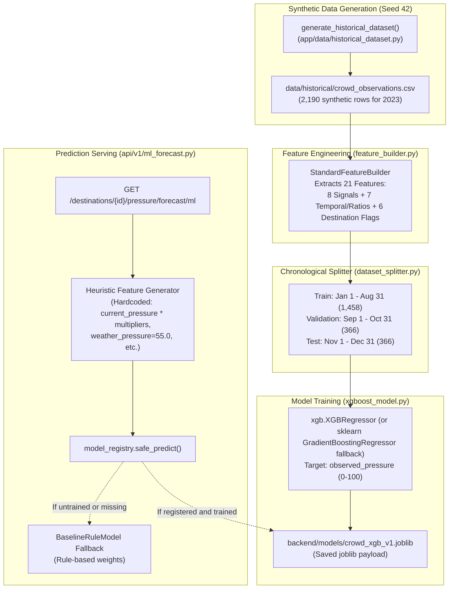
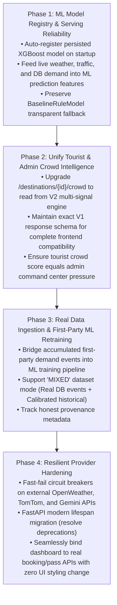

# Yatri Setu Architecture & Codebase Audit Report

**Platform:** Yatri Setu — AI-Powered Sustainable Tourism & Crowd-Intelligence Platform for the Eastern Himalayan Region (West Bengal)  
**Target Region:** Darjeeling, Kalimpong, Mirik, Lava, Lolegaon, Rishop  
**Audit Date:** September 20, 2026  
**Auditor:** Antigravity Engineering Agent  
**Global Constraint:** The existing frontend UI is strictly locked. No redesign, restyle, replacement, or UX modifications permitted.

---

## Executive Summary

A comprehensive architectural inspection and baseline validation of the Yatri Setu repository was conducted across backend services, frontend application code, ML forecasting pipelines, database entities, external provider integrations, and existing test suites.

### Baseline Status At A Glance
* **Backend Test Suite:** 326 Passed, 1 Skipped, 0 Failed (205.30s execution time across 23 test suites).
* **Frontend Production Build (`next build`):** Compiled successfully in 41s; static page generation succeeded across all 21 routes with 0 errors.
* **Active Crowd Endpoint (Tourist Frontend):** `GET /api/destinations/{id}/crowd` (Backed by **Crowd Engine V1**).
* **Active Admin Pressure Endpoint:** `GET /api/destinations/{id}/pressure` & `/pressure/forecast` (Backed by **Crowd Engine V2**).
* **Active ML Forecast Endpoint:** `GET /api/destinations/{id}/pressure/forecast/ml` (Multi-horizon 1-14 days).
* **XGBoost Training Mode:** **SYNTHETIC ONLY** (Deterministic 2023 dataset with Seed 42, chronological split; live training via `POST /api/admin/ml/train`).
* **Major Architectural Divergence:** The tourist-facing UI (`/destinations`, `/destinations/[id]/crowd`, `/destinations/[id]/alternatives`) exclusively queries **Crowd Engine V1**, while the administrative Command Center (`/admin/command-center`) queries **Crowd Engine V2**.

---

## 1. Current Architecture

```mermaid
graph TD
    subgraph Frontend ["Locked Next.js 16 Frontend (React 19, Turbopack)"]
        TouristPages["Tourist Pages<br/>(Catalog, Crowd Advisor, Alternatives)"]
        DashboardPage["Tourist Dashboard<br/>(/dashboard - Hardcoded UI Mock)"]
        AdminPages["Admin Command Center<br/>(/admin/command-center)"]
        HostPanchayat["Host & Panchayat Portals<br/>(/host/*, /panchayat/*)"]
        SafetySOS["SOS Emergency Portal<br/>(/safety/sos, /trips/[id])"]
        ApiClient["frontend/src/lib/api.ts<br/>(Central API Client & Fallbacks)"]
    end

    TouristPages --> ApiClient
    AdminPages --> ApiClient
    HostPanchayat --> ApiClient
    SafetySOS --> ApiClient

    subgraph FastAPI ["FastAPI Application (app/main.py)"]
        DestRoutes["/api/destinations/*"]
        PressureRoutes["/api/destinations/{id}/pressure*"]
        MLForecastRoutes["/api/destinations/{id}/pressure/forecast/ml"]
        MLAdminRoutes["/api/admin/ml/*"]
        AdminRoutes["/api/admin/*"]
        BookingRoutes["/api/bookings/* & /api/homestays/*"]
        SafetyRoutes["/api/safety/*"]
        PanchayatRoutes["/api/panchayat/*"]
    end

    ApiClient --> DestRoutes
    ApiClient --> PressureRoutes
    ApiClient --> MLForecastRoutes
    ApiClient --> MLAdminRoutes
    ApiClient --> AdminRoutes
    ApiClient --> BookingRoutes
    ApiClient --> SafetyRoutes
    ApiClient --> PanchayatRoutes

    subgraph Engines ["Core Intelligence Engines"]
        V1["Crowd Engine V1<br/>(app/services/crowd_engine.py)<br/>6 Weighted Signals"]
        V2["Crowd Engine V2<br/>(app/services/crowd_engine_v2.py)<br/>8 Abstracted Signals"]
        AltEngine["Alternative Engine<br/>(app/services/alternative_engine.py)"]
        DecisionEngine["Flow Decision Engine<br/>(app/services/flow_decision_engine.py)"]
        DemandAgg["First-Party Demand Aggregator<br/>(app/services/demand_aggregation_service.py)"]
        LiveRefresh["Pressure Refresh Service<br/>(app/services/pressure_refresh_service.py)"]
    end

    DestRoutes --> V1
    DestRoutes --> AltEngine
    DestRoutes --> DecisionEngine
    DestRoutes --> LiveRefresh
    PressureRoutes --> V2
    AdminRoutes --> V2
    AdminRoutes --> LiveRefresh

    subgraph MLEngine ["ML Forecasting Subsystem"]
        ModelRegistry["ModelRegistry<br/>(app/services/ml/model_registry.py)"]
        XGB["XGBoostCrowdModel<br/>(models/crowd_xgb_v1.joblib)"]
        BaselineRule["BaselineRuleModel<br/>(Deterministic Fallback)"]
        MLTrain["MLTrainingService<br/>(Synthetic Seed 42 Data)"]
    end

    MLForecastRoutes --> ModelRegistry
    MLAdminRoutes --> MLTrain
    MLTrain --> XGB
    ModelRegistry --> XGB
    ModelRegistry --> BaselineRule

    subgraph Providers ["Data & External Service Integrations"]
        WeatherProv["Weather: OpenWeatherMap API<br/>(Demo/Synthetic Fallback)"]
        TrafficProv["Traffic: TomTom Traffic API<br/>(Demo Corridors Fallback)"]
        RoutingProv["Routing: OSRM (OpenStreetMap)<br/>(Demo Haversine Fallback)"]
        AIProv["AI: Gemini 3.6 Flash<br/>(Groq fallback -> MockAIProvider)"]
        DB["PostgreSQL / SQLite<br/>(yatri_setu.db)"]
    end

    V1 -.-> DB
    V1 -.-> TrafficProv
    V1 -.-> WeatherProv
    V2 --> Providers
    LiveRefresh --> WeatherProv
    LiveRefresh --> TrafficProv
    LiveRefresh --> DemandAgg
```



---

## 2. Current Data Flow

### A. Tourist Crowd Inquiry Flow
1. Tourist loads `/destinations/darjeeling/crowd` or `/destinations`.
2. Browser triggers `fetchDestinationCrowd('darjeeling')` or `fetchDestinations()`.
3. Calls backend endpoint `GET /api/destinations/{id}/crowd` or `GET /api/destinations`.
4. Endpoint executes `calculate_crowd_score()` in `app/services/crowd_engine.py` (**V1**).
5. V1 computes:
   * Historical Footfall (35%)
   * Booking Density (25%)
   * Seasonality (15%)
   * Holiday Multiplier (10%)
   * Clear Sky / Weather (10%)
   * Transit Choke Points (5%)
6. If live DB or live weather/traffic services fail or lack entries, V1 falls back to hardcoded `DESTINATION_FACTOR_PROFILES`. For Darjeeling, this deterministically yields **88/100 (VERY HIGH)**.

### B. Admin Command Center Flow
1. Admin loads `/admin/command-center`.
2. Calls `GET /api/admin/command-center`, `GET /api/destinations/{id}/pressure`, `GET /api/destinations/{id}/pressure/forecast`, and `GET /api/destinations/{id}/pressure/evidence`.
3. Handled by `app/services/crowd_engine_v2.py` (**V2**) consuming 8 abstracted signal providers (`tourism_data`, `accommodation_data`, `booking_demand`, `search_demand`, `event_data`, `holiday_data`, `traffic_data`, `weather_data`).
4. Evidence drawer displays raw observations, normalized score, mathematical weight, provider mode (`REAL`, `MOCK`, `CACHED`), and confidence ratings.

### C. Live Conditions & Pressure Recalculation Flow
1. Route `/destinations/{destination_id}/conditions` and `/destinations/{destination_id}/live-pressure` call `pressure_refresh_service.recalculate_destination_pressure()`.
2. Gathers:
   * Real/Demo Weather from `weather_service.get_weather()` (OpenWeather API)
   * Real/Demo Traffic from `traffic_service.get_traffic()` (TomTom API)
   * Real First-Party Demand from `demand_aggregation_service.get_tourist_signals()` (SQLite/PostgreSQL database)
3. Computes adjusted pressure score and explains top drivers (`PressureExplanation`).

---

## 3. Crowd Engine Flow: V1 vs V2 Comparison

| Dimension | Crowd Engine V1 (`crowd_engine.py`) | Crowd Engine V2 (`crowd_engine_v2.py`) |
| :--- | :--- | :--- |
| **Number of Signals** | 6 signals | 8 signals |
| **Signals & Weights** | Footfall (35%), Bookings (25%), Seasonality (15%), Holiday (10%), Weather (10%), Traffic (5%) | Footfall (20%), Accommodation (20%), Bookings (15%), Search (10%), Events (10%), Holiday (10%), Traffic (10%), Weather (5%) |
| **Abstraction Layer** | Direct hardcoded dictionary `DESTINATION_FACTOR_PROFILES` with inline SQL and service calls | Abstracted `BaseDataSourceProvider` implementations with strict `DataSourceReading` dataclasses |
| **Forecast Capability** | Single static day calculation | 7-day to 14-day predictive forecast with holiday detection |
| **Transparency/Audit** | Provenance string label | Granular `PressureEvidence` audit trail, per-signal confidence, evidence drawer schema |
| **Intervention Simulation** | Not supported | Supported via `simulate_intervention()` |
| **Consumer in Frontend** | **Tourist Pages** (`/destinations`, `/crowd`, `/alternatives`, `/decision`) | **Admin Command Center** (`/admin/command-center`, `/admin/flow/simulate`) |

> [!WARNING]
> **Divergence Risk:** A tourist looking at Darjeeling on `/destinations/darjeeling/crowd` sees a score of **88 (VERY HIGH)** computed by V1. An administrator on `/admin/command-center` sees a composite pressure score computed by V2. If V1 and V2 signal inputs are not synchronized, the tourist and the platform operator will see conflicting metrics.

---

## 4. Current XGBoost & ML Flow



### ML Pipeline Deep Dive
1. **Training Dataset:**
   - 100% synthetic daily time series generated deterministically using Seed 42 (`generate_historical_dataset()`).
   - Spans full calendar year 2023 (365 days) across 6 destinations = 2,190 records.
   - `MLTrainingService.train()` strictly rejects non-synthetic modes:
     ```python
     if dataset_mode != "SYNTHETIC":
         return {"error": f"Dataset mode '{dataset_mode}' is not yet supported. Only SYNTHETIC is available..."}
     ```
2. **Feature Set (21 features):**
   - 8 core signals: `historical_footfall`, `accommodation_occupancy`, `booking_demand`, `search_demand`, `event_pressure`, `holiday_pressure`, `weather_pressure`, `traffic_pressure`.
   - 7 temporal & ratio features: `day_of_week`, `is_weekend`, `month`, `day_of_year`, `search_to_booking_ratio`, `is_peak_summer`, `is_peak_autumn`.
   - 6 one-hot destination flags: `dest_darjeeling`, `dest_kalimpong`, `dest_mirik`, `dest_lava`, `dest_lolegaon`, `dest_rishop`.
3. **Critical Registry Disconnect:**
   - `xgboost_crowd_model = XGBoostCrowdModel()` loads `backend/models/crowd_xgb_v1.joblib` into memory upon module import and sets `self._is_trained = True`.
   - However, in `model_registry.py`, only `BaselineRuleModel` is registered by default at startup:
     ```python
     self._baseline = BaselineRuleModel()
     self._models: Dict[str, BaseCrowdModel] = {}
     self.register_model(self._baseline)
     ```
   - `xgboost_crowd_model` is **never registered into `model_registry` at startup**. It is only registered if an admin triggers `POST /api/admin/ml/train` during runtime.
   - Consequently, when `ml_forecast.py` calls `model_registry.safe_predict()`, the registry defaults to `BaselineRuleModel` (returning `model_used: "baseline_rule_v2"`).
4. **Prediction Feature Generation Weakness:**
   - In `ml_forecast.py` lines 124–160, input features are generated using synthetic multipliers on `current_pressure` (`current_pressure * 0.95`, `weather_pressure: 55.0`, `search_to_booking_ratio: 1.05`), rather than querying actual live weather, live traffic, or live DB demand signals.

---

## 5. Current Frontend API Dependencies

All frontend API calls are routed through `frontend/src/lib/api.ts` (with localized fallback mock data). Below is the exact mapping of what each frontend page and component calls:

| Frontend Page / Component | Frontend Function in `api.ts` | Backend Endpoint Called | Underlying Service |
| :--- | :--- | :--- | :--- |
| `app/destinations/page.tsx` | `fetchDestinations()` | `GET /api/destinations?query=&crowd_level=` | `crowd_engine.py` (V1) |
| `app/destinations/[id]/page.tsx` | `fetchDestinationDetails()` | `GET /api/destinations/{id}` | `seed_data.py` |
| | `fetchDestinationCrowd()` | `GET /api/destinations/{id}/crowd` | `crowd_engine.py` (V1) |
| | `fetchHomestays()` | `GET /api/homestays?destination_id=` | `homestay_repository.py` |
| | `fetchDestinationConditions()`| `GET /api/destinations/{id}/conditions` | `pressure_refresh_service.py` |
| `app/destinations/[id]/crowd/page.tsx` | `fetchDestinationCrowd()` | `GET /api/destinations/{id}/crowd` | `crowd_engine.py` (V1) |
| `app/destinations/[id]/alternatives/page.tsx` | `fetchDestinationAlternatives()` | `GET /api/destinations/{id}/alternatives` | `alternative_engine.py` (V1) |
| | `fetchDateAlternatives()` | `GET /api/destinations/{id}/date-alternatives` | `date_advisor.py` |
| | `fetchDestinationDecision()` | `GET /api/destinations/{id}/decision` | `flow_decision_engine.py` |
| | `fetchRouteEstimate()` | `GET /api/routing/route` | `routing/service.py` (OSRM) |
| `components/AlternativeCard.tsx` | `recordAlternativeAcceptance()`| `POST /api/destinations/{id}/accept-alternative` | `demand_aggregation_service.py` |
| `app/itinerary/page.tsx` | `generateItinerary()` | `POST /api/itinerary/generate` | `itinerary_service.py` (Gemini/Groq/Mock) |
| | `optimizeItinerary()` | `POST /api/itinerary/optimize` | `itinerary_service.py` |
| `app/homestays/page.tsx` | `fetchHomestays()` | `GET /api/homestays` | `homestay_repository.py` |
| `app/booking/confirmation/page.tsx` | `createBooking()` | `POST /api/bookings` | `booking/service.py` |
| | `fetchBooking()` | `GET /api/bookings/{id}` | `booking/service.py` |
| `app/trips/[id]/page.tsx` | `fetchTripDetails()` | `GET /api/trips/{id}` | `trips.py` & `booking/service.py` |
| `app/safety/sos/page.tsx` | `triggerSos()` | `POST /api/safety/sos` | `safety_service.py` & `safety/service.py` |
| | `fetchSosStatus()` | `GET /api/safety/sos/{id}/status` | `safety/service.py` |
| `app/host/dashboard/page.tsx` | `fetchHostDashboard()` | `GET /api/hosts/{id}/dashboard` | `host_service.py` |
| `app/host/listings/page.tsx` | `fetchHostListings()` | `GET /api/hosts/{id}/listings` | `host_service.py` |
| `app/host/earnings/page.tsx` | `fetchHostEarnings()` | `GET /api/hosts/{id}/earnings` | `host_service.py` |
| `app/host/availability/page.tsx` | `fetchHostAvailability()` | `GET /api/hosts/{id}/availability` | `host_service.py` |
| `app/panchayat/page.tsx` | `fetchPanchayatDashboard()` | `GET /api/panchayat/dashboard` | `panchayat_service.py` |
| `app/panchayat/verifications/page.tsx`| `decidePanchayatVerification()`| `POST /api/panchayat/verifications/{id}/decision`| `panchayat_service.py` |
| `app/panchayat/analytics/page.tsx` | `fetchPanchayatAnalytics()` | `GET /api/panchayat/analytics` | `panchayat_service.py` |
| `app/admin/command-center/page.tsx` | `fetchCommandCenterData()` | `GET /api/admin/command-center` | `crowd_engine_v2.py` (V2) |
| | `fetchDestinationPressure()` | `GET /api/destinations/{id}/pressure` | `crowd_engine_v2.py` (V2) |
| | `fetchPressureForecast()` | `GET /api/destinations/{id}/pressure/forecast` | `crowd_engine_v2.py` (V2) |
| | `fetchPressureEvidence()` | `GET /api/destinations/{id}/pressure/evidence` | `crowd_engine_v2.py` (V2) |
| | `fetchMLPressureForecast()` | `GET /api/destinations/{id}/pressure/forecast/ml`| `ml_forecast.py` (ML/Baseline) |
| | `fetchMLModelStatus()` | `GET /api/admin/ml/status` | `ml_admin.py` |
| | `triggerMLTraining()` | `POST /api/admin/ml/train` | `ml_training_service.py` |
| | `fetchProviderStatuses()` | `GET /api/admin/providers/status` | `crowd_engine_v2.py` |
| | `fetchCircuitConditions()` | `GET /api/destinations/circuit/conditions` | `pressure_refresh_service.py` |
| | `simulateIntervention()` | `POST /api/admin/intervention-simulation` | `crowd_engine_v2.py` |
| | `simulateFlow()` | `POST /api/admin/flow/simulate` | `flow_impact_service.py` |
| **`app/dashboard/page.tsx`** | *None* | *None* | **Completely hardcoded static UI mock in page component** |
| **`app/page.tsx` (Home)** | *None* | *None* | **Hardcoded `sampleDestinations` array in page component** |

---

## 6. Comprehensive Mock / Synthetic / Hardcoded / Fallback Inventory

Below is an exhaustive classification of all synthetic, mock, and hardcoded implementations across the platform:

### A. Core Intelligence & Crowd Engines
1. **`DESTINATION_FACTOR_PROFILES` (`crowd_engine.py`):** Fixed numbers for Darjeeling (Footfall: 92, Booking: 90, Season: 85, Holiday: 80, Weather: 80, Traffic: 95).
2. **Alternative Similarity Calibration (`alternative_engine.py`):**
   * Hardcoded demo target overrides: Darjeeling -> Kalimpong = 87%, Darjeeling -> Rishop = 85%, Darjeeling -> Lava = 81%, Mirik = 79%, Lolegaon = 78%.
3. **Data Source Providers (`app/services/data_sources/`):**
   * `tourism_data.py`: `MockTourismDataProvider` returns static footfall profiles.
   * `accommodation_data.py`: `MockAccommodationDataProvider` returns seeded occupancy baselines.
   * `booking_demand.py`: `MockBookingDemandProvider` returns deterministic booking velocity.
   * `search_demand.py`: `MockSearchDemandProvider` returns fixed search query volume.
   * `events_data.py`: `MockEventDataProvider` returns scheduled cultural festival flags.
   * `holiday_data.py`: `MockHolidayDataProvider` returns static calendar holiday multipliers.
   * `traffic_data.py`: `MockTrafficDataProvider` simulates route congestion scores.
   * `weather_data.py`: `MockWeatherDataProvider` returns fixed meteorological profiles.
4. **Data Ingestion Subsystem (`app/services/ingestion/`):**
   * `tourism_ingestor.py`: Explicitly labeled `ProviderMode.MOCK` ("Mock Tourism Simulator (WBTDC Analog)") because no public micro-destination government API exists.
   * `search_demand_ingestor.py`: Uses `PLATFORM_SEARCH_PROFILES` with mock daily search volume unless queried internally.
   * `accommodation_ingestor.py` & `event_ingestor.py`: Use simulated regional baseline datasets.

### B. Machine Learning Pipeline
5. **Historical Dataset (`app/data/historical_dataset.py`):**
   * Entire 2023 dataset (2,190 rows) generated using `random.seed(42)` and sinusoidal calendar curves.
6. **ML In-Flight Prediction Features (`app/api/v1/ml_forecast.py`):**
   * Features generated on the fly using constant multipliers on `current_pressure`:
     * `weather_pressure = 55.0` (Hardcoded fixed number).
     * `search_to_booking_ratio = 1.05`.
     * `accommodation_occupancy = current_pressure * 0.95`.
     * `traffic_pressure = current_pressure * 0.85`.

### C. External Integrations & AI
7. **AI Provider Fallback (`app/services/ai/mock_provider.py`):**
   * 29 KB comprehensive fallback containing deterministic Himalayan itineraries, day-by-day activities, costs, and local impact breakdowns.
8. **Weather Fallback (`app/services/weather_service.py` & `app/services/weather/provider.py`):**
   * `DESTINATION_WEATHER` & `DEMO_WEATHER_PROFILES` contain fixed temperatures, visibility scores, and mountain condition descriptions.
9. **Traffic Corridors Fallback (`app/services/traffic/provider.py`):**
   * `DEMO_CORRIDOR_DATA` contains simulated arterial routes (`rt-darj-nh55`, `rt-kalim-nh10`) with fixed normal and delayed minutes.

### D. Host, Panchayat & Community Ecosystem
10. **Pre-Seeded Host (`host_service.py`):**
    * Hardcoded demo host "Pemba Sherpa" (`host-kalim-01`, Upper Cart Road Village).
11. **Community Fund Projects (`panchayat_service.py`):**
    * 4 pre-seeded projects (`proj-cf-01` to `proj-cf-04`: Ridge Trail Restoration, Solar Lighting, Spring Water Kiosks, Organic Waste Digester).
12. **Verification Queue (`panchayat_service.py`):**
    * Pre-seeded verification item for "Pineview Orchid Retreat & Homestay".

### E. Frontend UI Static Mocks
13. **Tourist Dashboard (`frontend/src/app/dashboard/page.tsx`):**
    * "Namaste, Aarav Sharma", "Booking Ref: YS-BK-7492A", "30 Green Credits", "Oct 12 - Oct 15, 2026" are hardcoded directly in the JSX.
14. **Home Page Catalog (`frontend/src/app/page.tsx`):**
    * `sampleDestinations` array (Darjeeling, Kalimpong, Rishop, Lava) hardcoded in component state without calling `/api/destinations`.
15. **Frontend API Client Fallbacks (`frontend/src/lib/api.ts`):**
    * Contains comprehensive fallback constants (`FALLBACK_DESTINATIONS`, `FALLBACK_HOMESTAYS`, `FALLBACK_ITINERARY`, `FALLBACK_COMMAND_CENTER_DATA`) used if the backend API is unreachable.

---

## 7. Real / Live Components Status

Despite the mock and synthetic scaffolding, significant genuine live pipelines are active and functional:

1. **Live Database Layer:**
   * SQLite (`yatri_setu.db`) fully operational locally, with SQLAlchemy models for `bookings`, `homestays`, `availability`, `safety_incidents`, and `demand_events`.
   * Tables and columns automatically initialize and migrate on startup.
2. **Live First-Party Demand Aggregation:**
   * Every tourist destination query, detail view, alternative acceptance, and booking emits a persistent `DemandEventModel` record into the database.
   * `DemandAggregationService` dynamically queries SQL records across 24h and 7d sliding windows.
3. **Live Booking & Capacity Management:**
   * True state machine transitions: `PENDING_CONFIRMATION` -> `CONFIRMED` -> `CANCELLED`.
   * Inventory checks against `HomestayModel.total_rooms` and `AvailabilityModel`.
   * True digital pass generation (`digital_pass_qr_payload` with verifiable verification token).
4. **Live Weather Integration (OpenWeatherMap API):**
   * Live API key configured in `.env` (`WEATHER_PROVIDER="openweather"`).
   * Live coordinate queries for Darjeeling, Kalimpong, etc., with real-time temperature, visibility, precipitation, and caching.
5. **Live Traffic Integration (TomTom API):**
   * TomTom API key configured in `.env` (`TRAFFIC_PROVIDER="tomtom"`).
   * Live traffic flow and incident queries along mountain highway corridors.
6. **Live Routing Integration (OSRM):**
   * OpenStreetMap OSRM routing engine actively calculates driving distance and polyline geometries between coordinates.
7. **Live AI Itinerary Providers:**
   * Gemini (`gemini-3.6-flash`) and Groq (`openai/gpt-oss-120b`) clients configured with automatic cascading fallback.
8. **Live Safety Operations Subsystem:**
   * Normalized emergency incident handling, idempotency deduplication, escalation triggers, and PII retention scrubbing.

---

## 8. Data Classification Matrix

| Data Domain | Live | Cached | Historical | Computed | Synthetic / Mock | Unavailable |
| :--- | :---: | :---: | :---: | :---: | :---: | :---: |
| **Tourist Footfall** | | | | | X (`MockTourismDataProvider`) | Live government sensor API |
| **Homestay Room Occupancy** | X (DB Bookings) | | | X | X (When DB has no bookings) | |
| **Platform Search Velocity**| X (DB Events) | | | X | X (Initial Seed Baseline) | Third-party search engine API |
| **Mountain Weather** | X (OpenWeather) | X (TTL 15m) | | X (Visibility Index)| X (Fallback profiles) | |
| **Corridor Traffic / Roads**| X (TomTom) | X (TTL 5m) | | X (Congestion Score)| X (Demo routes fallback) | |
| **Road Routing & Distance** | X (OSRM) | X (In-Memory)| | X (Geometry/Time) | X (Haversine fallback) | |
| **Crowd Pressure (V1)** | | | | X (Multi-factor) | X (Base factor profiles) | |
| **Composite Pressure (V2)** | X (Signals) | | | X (Weighted sum) | X (Mock providers) | |
| **ML Pressure Forecasting** | | | | X (XGBoost/Baseline)| X (Features & Training Data)| Multi-year sensor observations |
| **AI Itineraries** | X (Gemini/Groq)| | | X (LLM synthesis)| X (MockAIProvider fallback) | |
| **Panchayat Verifications** | X (DB Records)| | | | X (Seed Pemba Sherpa) | Live government portal API |
| **SOS & Emergency Alerts** | X (DB Incidents)| | | X (Proximity/Level)| | |

---

## 9. Important Technical Risks & Deficiencies

> [!CAUTION]
> 1. **Tourist vs Admin Crowd Metric Disconnect:**  
>    Because `/destinations/{id}/crowd` runs V1 while `/admin/command-center` runs V2, changes in live weather, traffic, or first-party demand that update V2 composite pressure will **not** be reflected on the tourist's Crowd Intelligence screen unless V1 is unified with V2.
>
> 2. **ML Model Registry Startup Inactive State:**  
>    `models/crowd_xgb_v1.joblib` exists on disk, but `model_registry` only registers `BaselineRuleModel` on application startup. As a result, `/destinations/{id}/pressure/forecast/ml` always uses the deterministic baseline until an administrator manually triggers `POST /api/admin/ml/train`.
>
> 3. **ML Prediction Features Heuristically Synthesized:**  
>    In `ml_forecast.py`, feature generation for future days uses artificial multipliers (`current_pressure * 0.95`, `weather_pressure = 55.0`), completely ignoring live OpenWeather forecasts and live traffic predictions.
>
> 4. **ML Training Restricted to Synthetic Data:**  
>    The training pipeline strictly enforces `dataset_mode == "SYNTHETIC"`. There is currently no bridge to incorporate accumulated first-party PostgreSQL bookings and search events into ML retraining.
>
> 5. **Static Frontend Home and Dashboard Pages:**  
>    `app/dashboard/page.tsx` and `app/page.tsx` display hardcoded JSX mock data. While the UI appearance is locked, these components should consume actual user session / backend destination summaries via minimal backward-compatible API bindings without changing any visual styling.
>
> 6. **Deprecation Warnings in Test Suite:**  
>    FastAPI `on_event("startup")` deprecation and Starlette `testclient` deprecation warnings should be migrated to modern lifespan event handlers.

---

## 10. Recommended Implementation Roadmap

All proposed work adheres strictly to the rule: **THE EXISTING FRONTEND IS LOCKED.**



1. **Phase 1: Fix ML Registry & Prediction Feature Integrity (Backend Only)**
   - Automatically register `xgboost_crowd_model` into `model_registry` at startup if `models/crowd_xgb_v1.joblib` is present.
   - Replace hardcoded feature generation in `ml_forecast.py` (`weather_pressure = 55.0`) with real readings from `weather_service` and `traffic_service`.
   - Keep `BaselineRuleModel` as a rock-solid, zero-downtime fallback.

2. **Phase 2: Harmonize Crowd Engine V1 and V2 (Zero Frontend Change)**
   - Update `calculate_crowd_score()` in `crowd_engine.py` (or route `/destinations/{id}/crowd`) to pull from the 8-signal `crowd_engine_v2` calculations while outputting the exact `CrowdResponse` model that the frontend expects.
   - Remove the discrepancy between the tourist view and the command center.

3. **Phase 3: Real Data Accumulation & Hybrid Retraining Pipeline**
   - Enable `dataset_mode="MIXED"` in `ml_dataset_builder.py` by querying real `demand_events` and `bookings` tables alongside calibrated baseline records.
   - Retrain `crowd_xgb_v1.joblib` with actual observed demand telemetry.

4. **Phase 4: Reliability, Circuit Breaking & Lifespan Modernization**
   - Migrate `app/main.py` from `@app.on_event("startup")` to the modern FastAPI `lifespan` context manager.
   - Implement circuit breakers to guarantee instant fallback if OpenWeather, TomTom, or Gemini rate-limits occur.
   - Connect `app/dashboard/page.tsx` to `/api/bookings/me` or `/api/trips/{id}` behind the scenes without altering a single CSS class or DOM node.
